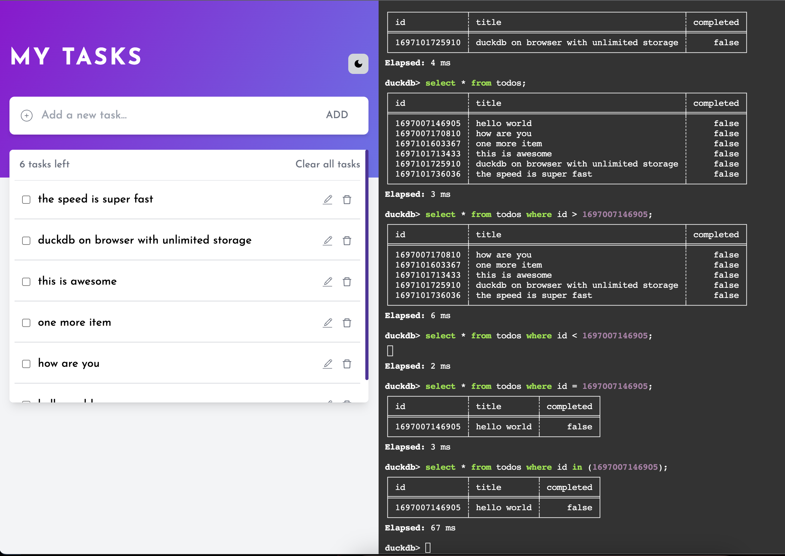

# TO DO APP using Vite + ReactJs + DuckDb

Our React.js-based To-Do app is a versatile and intuitive task management tool that empowers users to efficiently manage their daily tasks, prioritize activities, and boost productivity. With its sleek and responsive user interface, this app offers a seamless and delightful user experience.

Our React.js-based To-Do app is the perfect companion for individuals and teams seeking to optimize their task management and productivity. Whether you're juggling work, school, personal life, or all of the above, our app helps you stay organized, focused, and in control of your tasks.

Start maximizing your productivity today with our React.js To-Do app and experience a new level of task management efficiency.

## Key Features

Task Creation: Users can easily create new tasks with titles, descriptions, due dates, and optional priority levels. The user-friendly interface ensures quick input without any hassle.

Task Organization: The app allows users to categorize tasks into lists or projects, enabling them to maintain a structured workflow. Each list can have its unique set of tasks, making it easy to manage multiple aspects of life or work.

Task Prioritization: Users can prioritize tasks by assigning various levels, such as high, medium, or low priority. This feature helps users focus on what matters most and ensures they tackle their most important tasks first.

Real-time Updates: The app updates tasks and lists in real-time, so users can collaborate with others and see changes instantly. This feature is especially useful for teams and individuals who need to work together on projects.

Task Status Tracking: Users can mark tasks as completed, allowing them to track their progress easily. Completed tasks can be archived or moved to a separate section for future reference.

Due Date Reminders: The app provides due date reminders and notifications to ensure users never miss an important deadline. It helps users stay on top of their commitments and responsibilities.

Search and Filtering: Robust search and filtering options enable users to quickly locate specific tasks, even in extensive to-do lists. This feature enhances efficiency and saves valuable time.

User-friendly Design: The app's sleek and responsive design ensures a smooth experience across various devices and screen sizes. It adapts to the user's preferences, making task management effortless.

Customization: Users can customize the app's appearance with themes and colors, allowing them to personalize their task management environment.

Sync Across Devices: The app syncs seamlessly across multiple devices, ensuring that users have access to their tasks wherever they go. This feature promotes flexibility and accessibility.

Security and Privacy: User data is securely stored and protected, assuring privacy and data integrity.

## 🛠 Skills

HTML, CSS, Javascript, ReactJs+Vite, Tailwind CSS.

## Installation

Initialize a new React.js project:

```bash
yarn

```

## Running Tests

To run tests, run the following command

```bash
  yarn start

```


